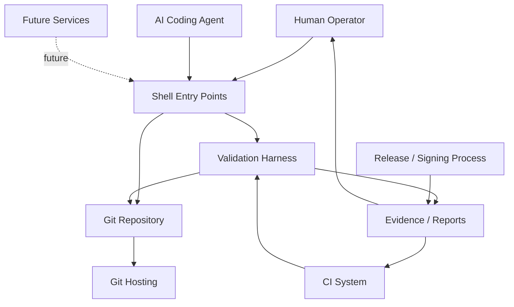

# System Context

## Purpose

The repository is a trust-sensitive, script-first control plane for bootstrap,
validation, evidence capture, and promotion decisions. It turns Git changes
into deterministic checks and records what ran, why it ran, and what evidence
was produced.

## Actors

| actor | role | current state |
|---|---|---|
| Human operator | approves promotion, release, signing, branch-protection, and other protected actions | live |
| AI coding agent | reads the repo, edits files, runs checks, writes reports | live within repository scope |
| CI system | runs the harness and parity gates | live |
| Git hosting | stores branches, PRs, and remote CI artifacts | live |
| Evidence consumer | reads reports, logs, and evidence bundles after the fact | live |
| Future worker fleet | distributed execution / agent scheduling | future only |
| Future dashboard / API | richer UI surfaces on top of the shell contract | future only |

## Context diagram

## Current integrations

- Shell entrypoints at the repo root
- Git as the source of truth
- Harness sections in `tests/section-map.tsv`
- Local parity runner in `scripts/ci-local.sh`
- Evidence and reports under `evidence/` and `reports/`
- GitHub Actions workflow checks

## Future-state only

- Distributed workers
- Machine-readable API surface
- Dashboard UI
- Policy engine separate from the current shell contracts
