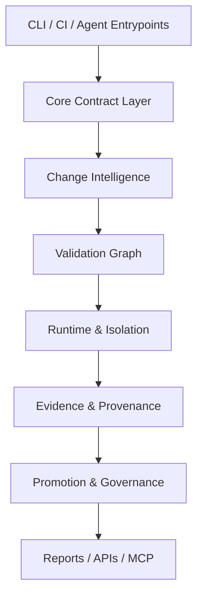

# Agent OS Harness — Product Requirements Document

## 1. Overview

**Product name:** Agent OS Harness

**One-liner:** A trust-first engineering control plane that turns repository changes into deterministic validation, signed evidence, and safe promotion decisions.

**Objective:** Make every significant repository action explainable, reproducible, and safe to promote across local development, CI, and clean-clone validation.

**Differentiation:** This is not a generic CI wrapper. It is contract-driven orchestration with exact Git identity, explicit runtime classification, immutable evidence, and promotion rules that fail closed.

**Magic moment:** A maintainer can inspect a run and immediately answer: what changed, why this validation ran, what executed, what evidence was produced, and whether the result is safe.

**Long-term design target:** The MVP is the first layer of a broader engineering control plane. The eventual shape is a layered architecture with stable contracts for platform primitives, core services, repository state, runtime isolation, policy, change intelligence, validation orchestration, evidence, governance, and interfaces. Every implementation decision should preserve that layering.

**Success criteria**

- Clean-clone and source validation remain in parity.
- Validation plans are deterministic for a given commit, policy, and environment.
- Every run produces evidence that is easy to inspect and hard to forge.
- Unsupported environments fail clearly and do not silently weaken security.

## 2. Technical Architecture

### Architecture overview



### Long-term architecture notes

- Keep top-level entrypoints thin and contract-driven.
- Move reusable logic into core services instead of duplicating shell behavior.
- Treat evidence, policy, and promotion as first-class products of the system.
- Preserve a clear path from local execution to distributed workers without changing the trust model.
- Expose machine-readable interfaces before building richer UI layers.

### Stack table

| Layer | Choice | Why |
|---|---|---|
| Interface | Bash CLI + JSON output | Matches the current repo, easy to script, easy to test |
| Orchestration | Bash + Node.js helpers | Keeps the control plane close to existing scripts while allowing typed helpers where needed |
| Validation | Shell, Node, Python test runners | Reuses existing harness behavior and existing contract checks |
| Identity | Git commit/signature identity | Exact source identity is the trust anchor |
| Evidence | Markdown, JSON, log files, manifests | Human-readable and machine-readable evidence |
| Storage | Git + filesystem artifacts | No application database is required for the MVP |
| Future UI | Optional web dashboard | Defer until command semantics are stable |

### Integration guide

1. Keep command contracts equals-form only where required by the repo’s CLI contract.
2. Route all validation through the core contract layer; do not let top-level entrypoints recurse into themselves.
3. Emit run manifests and evidence bundles for every validation path.
4. Treat unsupported runtime capabilities as explicit classification results.
5. Preserve clean-clone parity checks as a first-class gate.

### Repo structure

```text
scripts/        command entrypoints, CI parity, release helpers
tests/          harness checks, section registry, contracts
docs/           operator-facing contracts and product documentation
harness/        long-term extraction target for core services and adapters
reports/        promotion and validation reports
evidence/       immutable run outputs and provenance bundles
```

### Infrastructure

- Local shell execution for the main workflow.
- CI execution for parity checks.
- Optional isolated workers later for heavy or distributed validation.
- No database dependency for MVP.

### Security

- Require exact commit identity and signature verification where policy demands it.
- Fail closed on missing policy, missing evidence, or unsupported runtime capabilities.
- Normalize environment variables and PATH explicitly.
- Never silently downgrade from isolated to weaker execution.

### Cost estimate

For the MVP, cost is near-zero beyond developer time because the system runs locally and in existing CI. Future distributed execution, dashboards, or worker fleets will introduce infrastructure cost only if those capabilities are added.

## 3. Data Model

| Entity | Purpose | Key fields |
|---|---|---|
| RepositoryIdentity | Captures the exact repository state | repo, branch, commit, tree_hash, policy_digest |
| WorkspaceState | Describes the current working tree | dirty, changed_files, worktree_path, clone_path |
| Run | One validation or promotion execution | run_id, trigger, status, start_at, end_at, exit_code |
| ValidationPlan | The selected checks and order | plan_id, rules_version, nodes, fallback_reason |
| ValidationNode | One executable check | node_id, name, timeout, resource_profile, retries, evidence_required |
| RuntimeProfile | The execution environment | runtime_type, security_level, capabilities, path, toolchain_identity |
| EvidenceBundle | Immutable run evidence | evidence_id, manifest_path, log_paths, artifact_paths, signatures |
| PolicyDecision | Result of policy evaluation | policy_version, decision, matched_rules, reason |
| PromotionDecision | Final promote/block outcome | decision, approving_actor, residual_risks, references |
| AgentIdentity | Human or agent actor | actor_id, type, scope, budgets, allowed_actions |

## 4. API Specification

The MVP should expose a structured interface that can be used by CLI, CI, and future MCP tooling. The following endpoints define the future service contract:

| Method | Path | Request | Response |
|---|---|---|---|
| POST | `/runs` | trigger, repo identity, workspace state | run_id, selected plan, status |
| GET | `/runs/{run_id}` | none | status, timing, exit code, evidence refs |
| POST | `/validate` | commit, policy version, runtime profile | validation result, evidence bundle |
| POST | `/promotions` | run_id, approvals, policy refs | approved / blocked decision |
| GET | `/evidence/{run_id}` | none | manifest, logs, artifacts, signatures |
| GET | `/policy/{version}` | none | policy document and digest |
| POST | `/agents/authorize` | actor identity, requested scope | allowed / denied, budgets |

## 5. User Stories

- As a maintainer, I want the harness to tell me why a validation ran so I can trust the result.
- As a maintainer, I want clean-clone parity checks so I know source and clone behavior match.
- As an AI agent, I want bounded permissions so I can act without risking uncontrolled side effects.
- As a reviewer, I want exact evidence paths so I can audit the run later.
- As a release owner, I want promotion blocked unless policy, evidence, and signatures all align.

## 6. Functional Requirements

| ID | Priority | Requirement | Acceptance criteria |
|---|---|---|---|
| FR-001 | P0 | Classify changed files and select a validation plan | The same commit and policy produce the same plan |
| FR-002 | P0 | Enforce deterministic PATH and runtime resolution | Unsupported or missing tools fail clearly |
| FR-003 | P0 | Produce immutable evidence for every run | Evidence contains exact source, policy, and runtime references |
| FR-004 | P0 | Verify clean-clone parity | Source and clone validation outcomes are comparable |
| FR-005 | P1 | Expose machine-readable run results | JSON output contains plan, status, exit code, and refs |
| FR-006 | P1 | Support explicit fallback classification | Every fallback is labeled and justified |
| FR-007 | P1 | Block promotion on missing trust signals | Missing signatures or evidence cause rejection |
| FR-008 | P2 | Provide advisory risk scoring | Risk scoring may inform but cannot override policy |

## 7. Non-Functional Requirements

- **Performance:** Typical local validation should remain bounded and predictable; the harness should prefer targeted checks over full fallback when safe.
- **Security:** Fallbacks must never silently reduce isolation. Exact objects and exact evidence are required for promotion.
- **Accessibility:** Command output must remain readable in terminals and CI logs. Machine-readable JSON must be stable.
- **Scalability:** The system should support future distributed workers without changing the core contract.
- **Reliability:** Interrupted runs must be recoverable or explicitly marked incomplete; partial evidence must not be mistaken for success.

## 8. UI/UX Requirements

The primary UI is command-line and file-based.

### Core surfaces

- **Status output:** concise, scannable, and exact.
- **Run summaries:** include trigger, selected checks, exit code, and evidence path.
- **Failure output:** name the failed contract or unsupported capability.
- **Promotion output:** state the decision and the reasons.

### States

- **Empty:** show available commands or the next required step.
- **Loading:** show active run id and current stage.
- **Error:** name the failing contract, not just the exit code.
- **Populated:** show the run plan, evidence, and promotion state.

> Visual design tokens live in `docs/design.md`. If it does not exist yet, run the Design System skill before any rich UI is implemented.

## 9. Auth Implementation

There is no end-user auth for the MVP. Trust is established through repository permissions, commit signatures, explicit policy, and actor scope. If a future service is added, it should verify actor identity and requested scope before allowing mutation.

## 10. Payment Integration

None. This product is an internal trust/control-plane system, not a customer billing app.

## 11. Edge Cases & Error Handling

- Missing runtime tool: fail clearly and classify the environment as unsupported.
- PATH mismatch: normalize explicitly or stop with a diagnostic.
- Nested harness invocation: block recursion and explain the guard.
- Missing evidence directory: treat as a failure, not a success.
- Signature failure: reject promotion.
- Interrupted run: preserve partial evidence, mark the run incomplete, and avoid false success.

## 12. Dependencies & Integrations

- Git
- Bash
- Node.js
- Python
- GPG / gpgv
- GitHub Actions
- Optional MCP tooling
- Optional future worker runtimes

## 13. Out of Scope

- Rich multi-user web UI for the MVP
- Distributed worker fleet
- Predictive optimization
- Machine-learning-driven policy overrides
- Monetization and billing
- Replacing the repository’s script-first contract in the near term

## 14. Open Questions

- Which future interface should become the primary non-CLI surface: dashboard, MCP, or both?
- How much of the current shell implementation should be extracted into typed modules in phase 2?
- Which distributed runtime should be considered first when the platform needs remote workers?
- Should evidence retention be bounded by policy or kept indefinitely for certain classes of runs?
